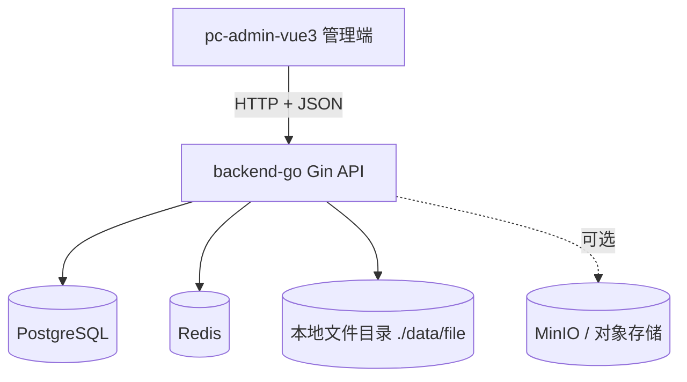
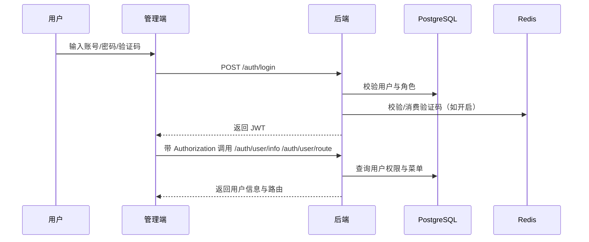

# 架构设计

## 总体架构

## 技术栈
- **后端:** Go + Gin + Swaggo（Swagger UI）
- **前端:** Vue3 + Vite + TypeScript + Pinia + Vue Router
- **数据:** PostgreSQL
- **缓存:** Redis

## 核心流程

## 重大架构决策
当前阶段未记录独立 ADR；如后续引入关键架构选型（如多租户、分布式会话、权限缓存策略），应在变更方案包 `how.md` 中补充并在此处建立索引。

