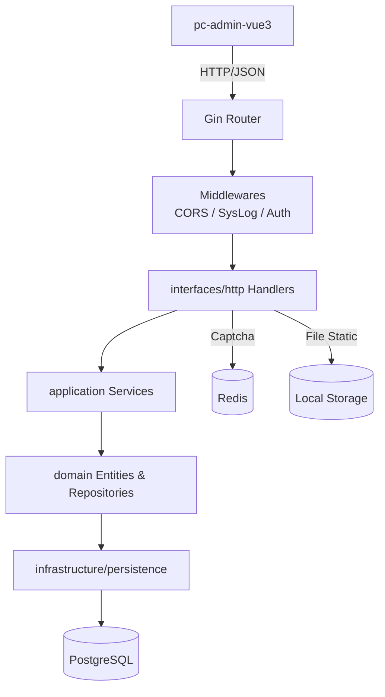
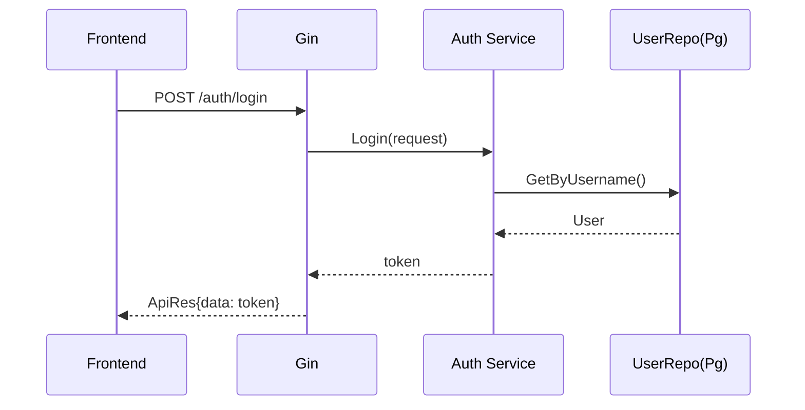

# 架构设计

## 总体架构

## 技术栈
- **后端:** Go + Gin
- **数据:** PostgreSQL / Redis
- **文档:** Swagger

## 核心流程（示例：认证登录）

## 重大架构决策

| adr_id | title | date | status | affected_modules | details |
|--------|-------|------|--------|------------------|---------|
| ADR-001 | 系统日志默认脱敏与截断 | 2026-01-12 | ✅已采纳 | syslog/system/security | `history/2026-01/202601120018_security-hardening-abc/how.md#adr-001-系统日志默认脱敏与截断` |
| ADR-002 | 禁止内置默认密钥并强制 env 校验 | 2026-01-12 | ✅已采纳 | cmd/security | `history/2026-01/202601120018_security-hardening-abc/how.md#adr-002-禁止内置默认密钥并强制-env-校验` |
| ADR-003 | 列表分页下推到 SQL | 2026-01-12 | ✅已采纳 | system | `history/2026-01/202601120018_security-hardening-abc/how.md#adr-003-列表分页下推到-sql` |
| ADR-004 | 字典模块采用 Service + Repository 分层 | 2026-01-12 | ✅已采纳 | system | `history/2026-01/202601120110_dict-refactor-layering/how.md#adr-004-字典模块采用-service--repository-分层` |
| ADR-005 | 鉴权由中间件统一完成并写入 Context | 2026-01-12 | ✅已采纳 | auth/system | `history/2026-01/202601120135_auth-middleware-context/how.md#adr-005-鉴权由中间件统一完成并写入-context` |
